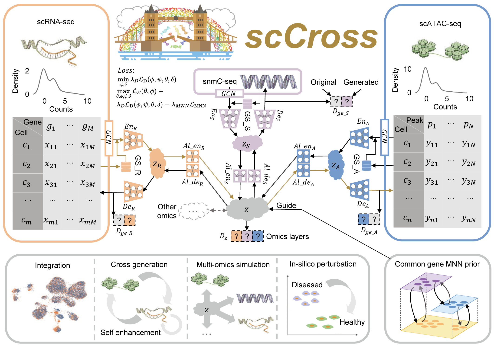

Welcome to scCross' documentation!
==================================

``scCross``  A Deep Learning-Based Model for the integration, cross-dataset cross-modality generation, self enhancing and matched multi-omics simulation of single-cell multi-omics data. Our model excels at maintaining in-silico perturbations during cross-modality generation and harnessing these perturbations to identify key genes.

.. toctree::
   :maxdepth: 2
   :caption: Contents:

   install
   tutorials
   api
   release

